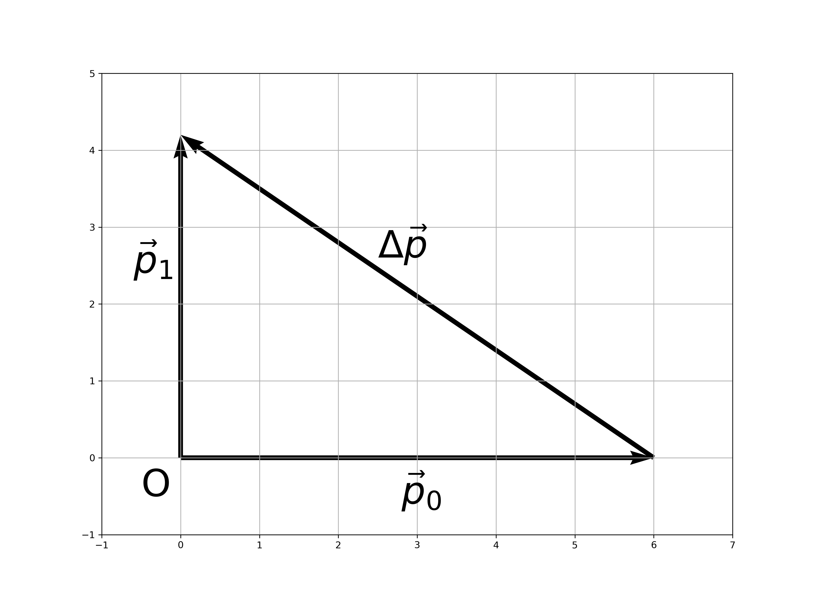

## 习题


用棒打击质量为$0.3kg$、速率等于$20m/s$的水平飞来的球，球飞到竖直上方$10m$的高度。求棒给予球的冲量有多大？设球与棒的接触时间为$0.02s$，求球受到的平均冲力。


## 💯解答

**基于动量定理，通过求动量增量得到冲量，进而计算平均冲力。**

以球和棒接触点为原点建立坐标系，

- 球的初动量

$$\vec P_0 = m \vec v = 0.3 * 20 \vec i \ (kg \cdot m/ s) = 6.0 \ \vec i \ ( kg \cdot m/ s )$$

- 球的末动量

$$\vec P_1 = m \vec v_1 = m \sqrt{2gh} \ \vec j= 0.3 * \sqrt{2 \times 9.8 \times 10}  \ \vec j (\ kg \cdot m/ s) = 4.2 \ \vec j \  (kg \cdot m/ s)$$

- 由动量定理，对球而言，其冲量为

$$\vec I = \Delta \vec p = \vec p_1 - \vec p_0 = -6.0 \ \vec i + 4.2 \ \vec j \ (N \cdot s)$$

- 冲量大小为

$$I=\sqrt{I_x^2 + I_y^2}=7.32 \ (N \cdot s)$$

- 球受到的平均冲力为
  $$F=\frac{I}{\Delta t} = 366 N$$

  

## 代码

```python
import numpy as np
import matplotlib.pyplot as plt

#小球质量
m=0.3
#重力加速度
g=9.8 
#初速度
v_0 = 20
#末高度
h_1 = 10
#接触时间
t=0.02

#初动量
p_0 = 0.3 * np.array([20,0])

#末动量
p_1 = 0.3 * np.array([0, np.sqrt(2 * g * h_1 ) ])

#冲量动量差
I = p_1 - p_0
print(f"冲量为 {I[0]} i + {I[1]} j ")

#冲量的大小
I_n = np.linalg.norm(I)
print(f"冲量的大小为{I_n:4.2f} Ns ")

#平均冲力力
F = I_n / t
print(f"平均冲力为{F:4.0f} N")
#力的方向
theta = np.arctan(I[1]/I[0])/np.pi*180
print(f"力的方向为{theta:4.0f}° ")


# 作图
import matplotlib.pyplot as plt
import numpy as np
fig,ax=plt.subplots(figsize=(12,9))
#绘制从[0,0]到[2,2]的向量
a=ax.quiver(0, 0, *p_0, angles='xy', scale_units='xy', scale=1)
ax.text(-0.5,-0.5,r"O",fontsize=40)
a=ax.quiver(0, 0, *p_1, angles='xy', scale_units='xy', scale=1)
ax.text(2.8,-0.6,r"$\vec{p}_0$",fontsize=40)
a=ax.quiver(*p_0, *I, angles='xy', scale_units='xy', scale=1)
ax.text(-0.6,2.4,r"$\vec{p}_1$",fontsize=40)
ax.text(2.5,2.6,r"$\Delta \vec{p}  $",fontsize=40)
ax.set_xlim([-1, 7])
ax.set_ylim([-1, 5])
plt.grid(zorder=0)
plt.savefig("2-10.jpg",dpi=300)
plt.show()
```

## 💊评论区

感谢给予支持的朋友，您的支持是我前进的动力 🎉

